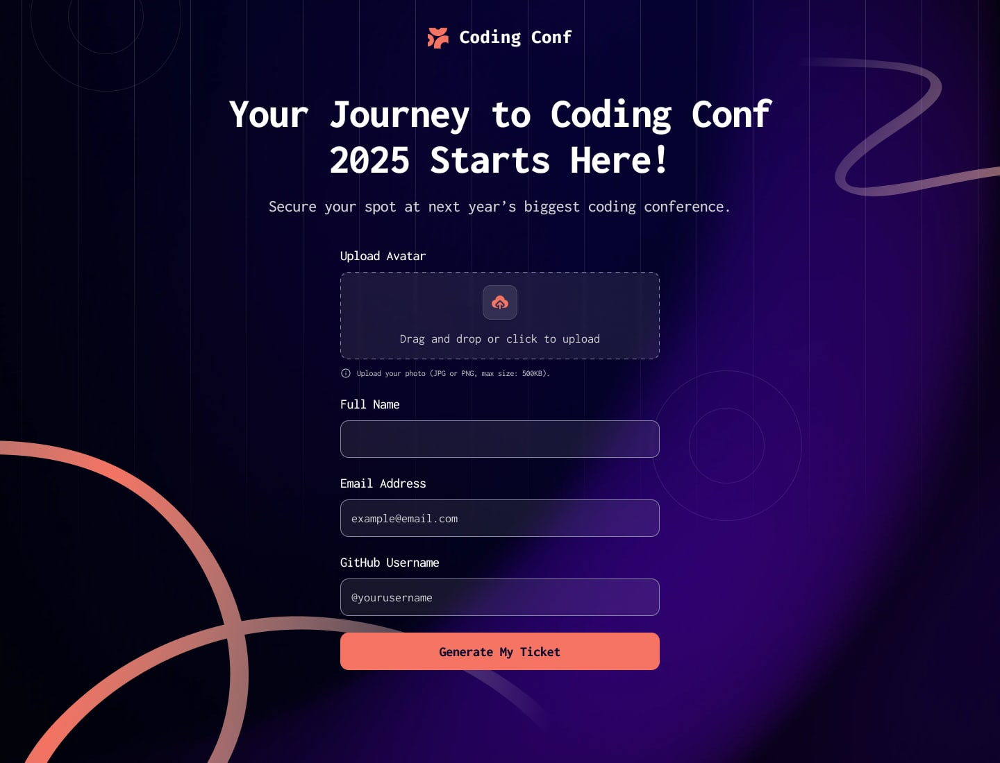
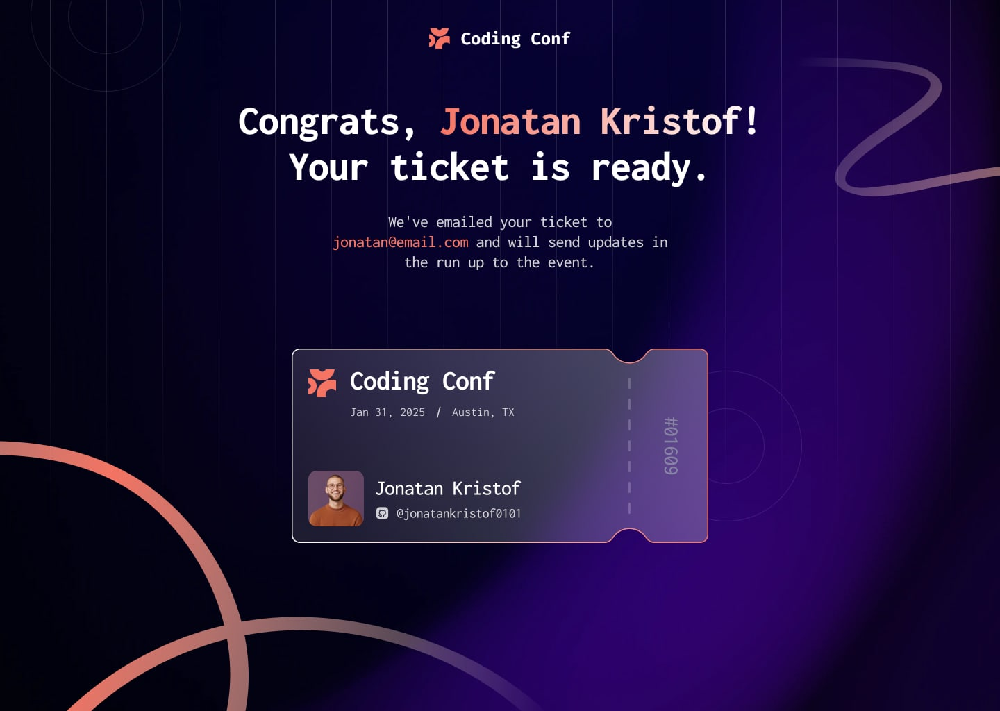

# 🎟️ Gerador de Ingresso para Conferência (Conference Ticket Generator)

> **Trabalho Acadêmico**  
> **Curso:** Engenharia de Software  
> **Disciplina:** Design e Desenvolvimento Frontend  
> 
> 🌐 **Acesse a Aplicação e teste ao Vivo:**  
> **[https://murilo-nascimento-lodi.github.io/gerador-de-ingresso-conferencia/](https://murilo-nascimento-lodi.github.io/gerador-de-ingresso-conferencia/)**

---

## 📌 Visão Geral do Projeto

Este projeto consiste no desenvolvimento de uma aplicação web interativa de **Gerador de Ingresso para Conferência**, criada como solução para o **Desafio 01** proposto na disciplina de **Design e Desenvolvimento Frontend**.

A aplicação permite que o usuário preencha um formulário completo com upload de foto de avatar, validações em tempo real de e-mail e dados obrigatórios, gerando dinamicamente um **ingresso personalizado para a conferência (Coding Conf 2025)** com número serial único.

---

## 🎨 Demonstração & Fidelidade Visual

O layout da interface é responsivo e se adapta de forma elegante entre dispositivos móveis (375px) e computadores (1440px+).

| Estado de Formulário | Estado de Ingresso Gerado |
| :---: | :---: |
|  |  |

---

## ✅ Requisitos Atendidos & Funcionalidades

| Requisito / Critério | Descrição | Status |
| :--- | :--- | :---: |
| **1. Layout Responsivo** | Funciona perfeitamente em telas móveis (375px) e desktop (1440px+). | ✅ Concluído |
| **2. HTML Semântico & Acessível** | Marcação semântica com `<main>`, `<header>`, `<form>`, `<section>`, `<footer>`, acessibilidade ARIA e navegação via teclado. | ✅ Concluído |
| **3. Fidelidade ao Design** | Cores fiéis ao `style-guide.md`, tipografia oficial (Inconsolata do Google Fonts), SVGs decorativos e cartão com recortes de bilhete. | ✅ Concluído |
| **4. Código Organizado** | CSS bem estruturado com variáveis (`:root`), JavaScript limpo e padronizado em módulos funcionais. | ✅ Concluído |
| **5. Repositório no GitHub com README.md** | Código publicado com documentação acadêmica detalhada. | ✅ Concluído |
| **6. Geração Dinâmica (JavaScript)** | Upload de imagem (drag & drop), prévia do avatar, validações de e-mail/tamanho e geração do bilhete. | ✅ Concluído |

---

## 🛠️ Tecnologias Utilizadas

- **HTML5 Semântico:** Formulário acessível, inputs com atributos de validação e landmarks semânticos.
- **CSS3 Moderno:**
  - Variáveis CSS (`:root`) para padronização da paleta de cores e tipografia.
  - **Flexbox** e alinhamento responsivo.
  - **Media Queries** para suporte a telas de 320px até telas grandes.
  - Efeitos de fundo dinâmicos com gradientes radiais e padrões SVG (`pattern-ticket.svg`, `pattern-lines.svg`).
- **JavaScript ES6+ (Vanilla JS):**
  - Manipulação do DOM e alternância entre estados (Formulário ➔ Ingresso).
  - API FileReader para upload e prévia local da imagem do avatar.
  - Suporte a eventos de *Drag & Drop* no upload de fotos.
  - Validação de formato (JPG/PNG), limite de tamanho (500KB) e padrão de e-mail.
  - Geração de código serial único de 5 dígitos para o ingresso (`#01609`).
- **Google Fonts:** Fonte [Inconsolata](https://fonts.google.com/specimen/Inconsolata) (pesos 400, 500, 700, 800).

---

## 📐 Cores e Tipografia (Guia de Estilo)

- **Fundo Principal (Neutral 900):** `hsl(248, 70%, 10%)`
- **Texto Principal (Neutral 0):** `hsl(0, 0%, 100%)`
- **Texto Secundário (Neutral 300):** `hsl(252, 6%, 83%)`
- **Destaque Laranja (Orange 500):** `hsl(7, 88%, 67%)`
- **Destaque Laranja Hover (Orange 700):** `hsl(7, 71%, 60%)`
- **Gradiente do Título:** `linear-gradient(90deg, hsl(7, 86%, 67%), hsl(0, 0%, 100%))`

---

## 📁 Estrutura de Arquivos

```text
conference-ticket-generator-main/
├── assets/
│   ├── images/
│   │   ├── favicon-32x32.png      # Favicon
│   │   ├── icon-github.svg        # Ícone do GitHub
│   │   ├── icon-info.svg          # Ícone de informação/erro
│   │   ├── icon-upload.svg        # Ícone de upload de foto
│   │   ├── image-avatar.jpg       # Avatar de exemplo
│   │   ├── logo-full.svg          # Logo Coding Conf
│   │   ├── pattern-circle.svg     # Padrão decorativo circular
│   │   ├── pattern-lines.svg      # Linhas de fundo
│   │   ├── pattern-sqiggly-line-bottom.svg
│   │   ├── pattern-sqiggly-line-top.svg
│   │   └── pattern-ticket.svg     # Fundo do ingresso
├── design/
│   ├── desktop-design-form.jpg    # Referência do Formulário
│   └── desktop-design-ticket.jpg  # Referência do Ingresso
├── index.html                     # Estrutura HTML5
├── style.css                      # Estilos CSS3 e temas
├── script.js                      # Validações e geração dinâmica JS
├── style-guide.md                 # Guia de estilo do desafio
└── README.md                      # Documentação completa
---


````
## 🚀 Como Executar o Projeto Localmente

Para acessar o projeto, basta abrir a página do **GitHub Pages** deste repositório.

Você também pode executar o projeto localmente seguindo os passos abaixo:

1. Clonar este repositório para sua máquina:

   ```bash
   git clone https://github.com/SEU-USUARIO/conference-ticket-generator.git
````

 2. Acesse a pasta do projeto:

   ```
   cd conference-ticket-generator
   ```
3. Abra o arquivo `index.html` em qualquer navegador web (Google Chrome, Firefox, Edge, Safari) ou utilize a extensão **Live Server** do VS Code.

---

 ## 👨‍💻 Autor

 Trabalho desenvolvido por **Murilo Lodi do Nascimento** para compor nota da disciplina de **Design e Desenvolvimento Frontend** do curso de **Engenharia de Software**.

```

```
